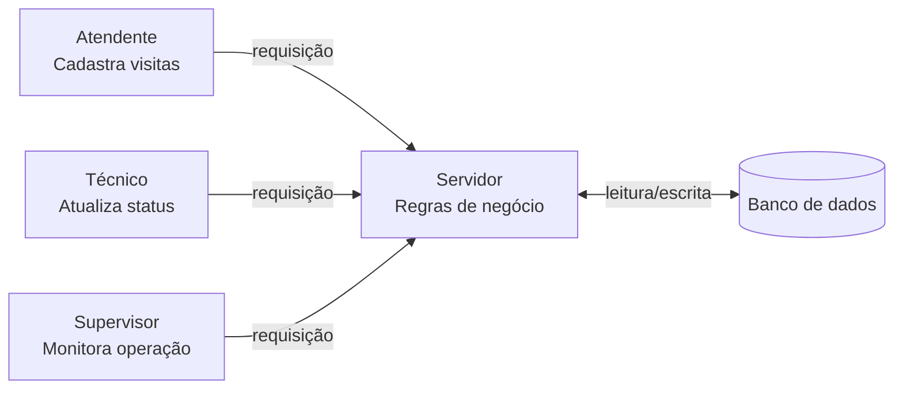
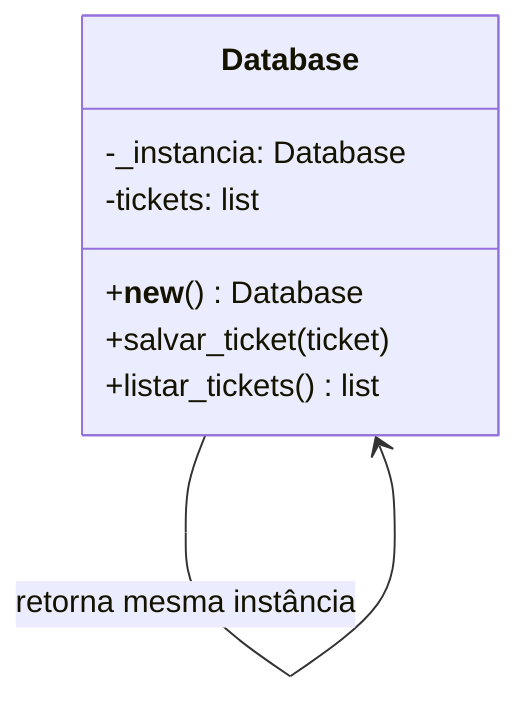
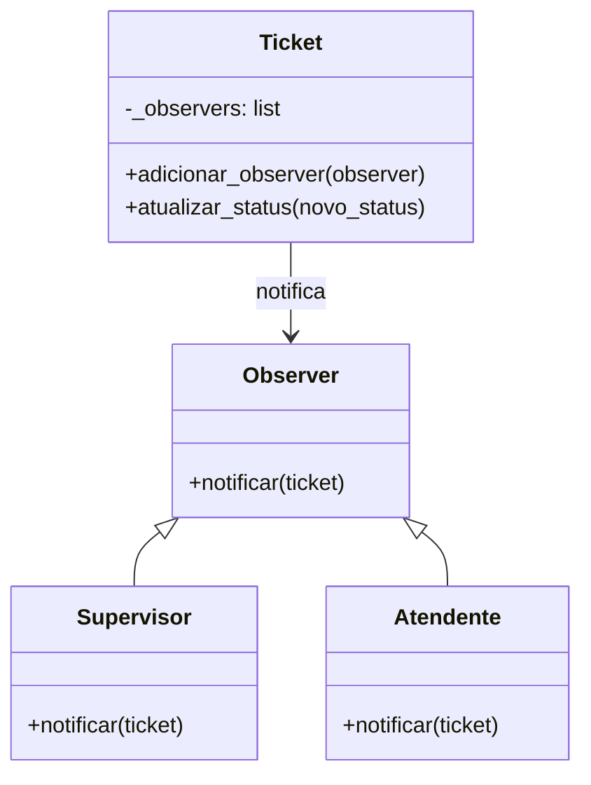

# Sistema de Agendamento de Visitas Técnicas — Parte 2

**Conversa de referência:** https://claude.ai/share/c0885afb-f333-43fd-9ab7-411f45f57584

---

## Tarefa 2.1 — Definição da Arquitetura

### Padrão escolhido: Cliente-Servidor

O padrão Cliente-Servidor é o mais adequado visto que vários perfis precisam acessar o sistema de lugares diferentes — atendente no escritório, técnico em campo, supervisor gerenciando a operação. Todos consultam a mesma fonte de dados centralizada no servidor, o que elimina o problema de informações desencontradas identificado nas entrevistas, onde cada funcionário tinha uma versão diferente da realidade.

---

### Diagrama de componentes

---

### Componentes e responsabilidades

**Cliente** — é a interface que o usuário acessa, envia requisições ao servidor e exibe as respostas.

**Servidor** — recebe as requisições, aplica as regras de negócio e retorna os dados ao cliente.

**Banco de dados** — armazena e persiste todos os dados do sistema.

---

### Limitação: ponto único de falha

O servidor é o único ponto pelo qual tudo passa, então se ele falha, o sistema inteiro para — nenhum cliente consegue enviar ou receber nada. É como se o servidor fosse o coração do sistema: se ele para, tudo para junto.

---

## Tarefa 2.2 — Padrões de Projeto

### Padrão 1 — Singleton

**Categoria:** Criacional

**Onde foi aplicado:** `sistema_tickets.py` — classe `Database`

**Por que foi usado:** Garante que existe apenas uma instância do banco de dados no sistema, o que resolve diretamente a H1, que pede uma fonte única de dados centralizada. Sem o Singleton, cada parte do código poderia criar seu próprio banco, resultando em dados desincronizados.

**Diagrama:**

---

### Padrão 2 — Observer

**Categoria:** Comportamental

**Onde foi aplicado:** `sistema_tickets.py` — classes `Ticket`, `Supervisor` e `Atendente`

**Por que foi usado:** Quando o técnico atualiza o status de um ticket, supervisor e atendente precisam ser notificados automaticamente, sem depender de mensagem no WhatsApp. O Observer resolve isso: o ticket notifica todos os interessados registrados sempre que o status muda, atendendo diretamente a H3.

**Diagrama:**

---

## Tarefa 2.3 — Testes Automatizados

**Abordagem utilizada:** Teste caixa preta com `unittest`

O teste caixa preta testa o comportamento sem se preocupar com o que está dentro do código. Quando algum teste falha, ele aponta exatamente qual cenário quebrou, aí se vai ao código entender o porquê. É mais prático porque separa bem as responsabilidades — o teste não conhece a implementação, só sabe o que deveria acontecer.

**Arquivos:** `testes.py` e `sistema_tickets.py`

**Métodos testados:**

- `Database.salvar_ticket` — 3 casos de teste
- `Ticket.atualizar_status` — 3 casos de teste

**Resultado:** 6 testes, todos passando em 0.003s

---

### Revisão crítica — dificuldades de teste em larga escala

O maior desafio de teste em larga escala seria a cobertura dos tickets, visto que em uma empresa de grande porte o volume e a variedade de combinações possíveis cresce exponencialmente. Testar cenários como tickets de diferentes tipos, clientes com históricos extensos e conflitos de horário exigiria um número muito grande de casos de teste. Isso tornaria o processo de validação custoso em tempo e esforço, dificultando manter uma cobertura completa do sistema.
